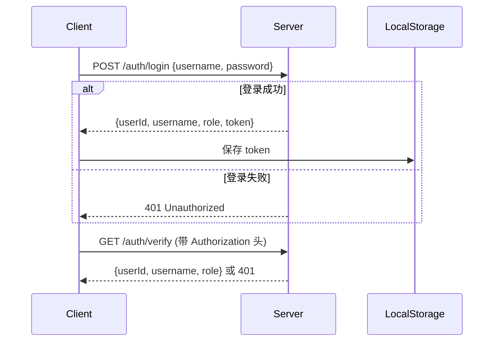

# 习惯管理 API 文档

**版本：1.0**  
**最后更新：2025-11-20**

---

## 🌟 概述

本 API 专为习惯养成应用设计，提供习惯管理、打卡记录、成就系统等核心功能。所有接口均采用 **RESTful 风格**，响应格式为标准 JSON，支持分页、过滤和统计分析。数据时间戳均使用 **ISO 8601 格式**（如 `2025-11-20T00:00:00Z`）。

> 💡 **小贴士**：接口设计时已考虑移动端友好性，参数命名清晰易用，比如 `frequency` 直接对应 `daily`/`weekly`/`monthly`，避免了冗余字段。

---

## 📦 数据模型（关键结构）

### 1. 基础类型

| 类型             | 说明                     | 示例                                                            |
| ---------------- | ------------------------ | --------------------------------------------------------------- |
| `HabitFrequency` | 习惯频率                 | `daily`（每日）、`weekly`（每周）、`monthly`（每月）            |
| `Goal`           | 目标配置                 | `{ targetDays: 30, durationMinutes: 30 }`                       |
| `HabitBase`      | 习惯基础信息（不含统计） | `id`, `title`, `description`, `goal`, `frequency`, `category`   |
| `HabitStats`     | 习惯统计                 | `currentStreak`（当前连续天数）、`successRate`（成功率，0-100） |

### 2. 核心对象

| 对象                | 说明               | 关键字段                                                     |
| ------------------- | ------------------ | ------------------------------------------------------------ |
| **`Habit`**         | 完整习惯（含统计） | `HabitBase` + `stats`                                        |
| **`CheckInRecord`** | 打卡记录           | `date`（YYYY-MM-DD）、`duration`（分钟）、`mood`（1-5分）    |
| **`AllStats`**      | 全局统计           | `totalCheckedIn`（总打卡数）、`avgSuccessRate`（平均成功率） |
| **`Achievement`**   | 成就系统           | `name`（成就名）、`isUnlocked`（是否解锁）                   |

> ✨ **设计亮点**：`ModifyHabitForm` 严格限制可修改字段（排除 `id`/`createdAt` 等），避免意外覆盖，安全又高效。

---

## 🔌 API 参考列表

---

### ✅ 1. 获取习惯列表

**端点**：`GET /habits`  
**用途**：分页查询习惯列表，支持频率、分类、关键词过滤。  
**请求参数**：
| 参数 | 类型 | 必填 | 说明 |
|------|------|------|------|
| `frequency` | `HabitFrequency` | 否 | `daily`/`weekly`/`monthly` |
| `category` | `string` | 否 | 分类名称（如 `健康`） |
| `page` | `number` | 否 | 页码（默认 `1`） |
| `pageSize` | `number` | 否 | 每页数量（默认 `10`） |
| `search` | `string` | 否 | 标题/描述关键词 |

**响应**（`200 OK`）：

```json
{
  "total": 15,
  "data": [
    {
      "id": "hab123",
      "title": "每日阅读30分钟",
      "description": "专注阅读，提升认知",
      "goal": { "targetDays": 30, "durationMinutes": 30 },
      "frequency": "daily",
      "category": ["学习"],
      "createdAt": "2025-01-01T00:00:00Z",
      "updatedAt": "2025-11-20T00:00:00Z",
      "stats": {
        "currentStreak": 7,
        "longestStreak": 14,
        "totalCompleted": 7,
        "totalMissed": 0,
        "successRate": 100
      }
    }
  ]
}
```

**错误**：

- `400 Bad Request`：参数无效（如 `frequency` 值非法）
- `500 Internal Server Error`：服务异常

---

### ✅ 2. 获取今日习惯（待完成）

**端点**：`GET /habits/today`  
**用途**：返回当天需完成的习惯列表（自动按日期筛选）。  
**请求参数**：无

**响应**（`200 OK`）：

```json
{
  "habits": [
    {
      "id": "hab123",
      "title": "每日阅读30分钟",
      "completed": false, // 今日是否已完成
      "stats": { ... }
    }
  ],
  "date": "2025-11-20"
}
```

> 💡 **贴心设计**：`completed` 字段直接告知今日状态，无需额外逻辑判断。

---

### ✅ 3. 添加新习惯

**端点**：`POST /habits`  
**用途**：创建新习惯（需包含 `goal` 和 `category`）。  
**请求体**（`HabitForm`）：

```json
{
  "title": "早起跑步",
  "description": "每天早晨6点跑步30分钟",
  "goal": { "targetDays": 30, "durationMinutes": 30 },
  "frequency": "daily",
  "category": ["运动", "健康"]
}
```

**响应**（`201 Created`）：

```json
{
  "habit": {
    "id": "hab456",
    "title": "早起跑步",
    "goal": { "targetDays": 30, "durationMinutes": 30 },
    "stats": { "currentStreak": 0, "successRate": 0, ... }
  }
}
```

**错误**：

- `400 Bad Request`：`goal.targetDays` 未设置或为负数

---

### ✅ 4. 修改习惯

**端点**：`PUT /habits/{id}`  
**用途**：修改习惯属性（**仅限指定字段**，如 `title`/`goal`）。  
**路径参数**：
| 参数 | 类型 | 说明 |
|------|------|------|
| `id` | `string` | 习惯唯一ID |

**请求体**（`ModifyHabitForm`）：

```json
{
  "title": "早起跑步30分钟",
  "goal": { "durationMinutes": 45 } // 仅修改持续时间
}
```

> ⚠️ **安全提示**：`ModifyHabitForm` 仅允许修改 `title`/`description`/`goal`/`frequency`/`category`，**不可修改 `id`/`stats`**。

**响应**（`200 OK`）：

```json
{
  "habit": {
    "id": "hab456",
    "title": "早起跑步30分钟",
    "goal": { "targetDays": 30, "durationMinutes": 45 },
    "updatedAt": "2025-11-20T10:30:00Z"
  }
}
```

---

### ✅ 5. 删除习惯

**端点**：`DELETE /habits/{id}`  
**用途**：彻底移除习惯（连同打卡记录）。  
**路径参数**：
| 参数 | 类型 | 说明 |
|------|------|------|
| `id` | `string` | 习惯ID |

**响应**（`204 No Content`）：无内容

**错误**：

- `404 Not Found`：习惯ID不存在

---

### ✅ 6. 打卡习惯

**端点**：`POST /habits/check-in`  
**用途**：完成今日习惯打卡（需 `habitId` 和 `duration`）。  
**请求体**（`CheckInForm`）：

```json
{
  "habitId": "hab123",
  "duration": 35, // 实际持续时间（分钟）
  "notes": "阅读了《三体》", // 可选备注
  "mood": 4 // 心情评分（1-5）
}
```

**响应**（`200 OK`）：无内容

> 🌈 **细节优化**：支持记录心情和备注，让习惯养成更人性化！

---

### ✅ 7. 取消打卡

**端点**：`DELETE /habits/check-in/{habits_id}`  
**用途**：取消当日已打卡记录（注意：`habits_id` 是习惯ID，非打卡ID）。  
**路径参数**：
| 参数 | 类型 | 说明 |
|------|------|------|
| `habits_id` | `string` | 习惯ID |

**响应**（`200 OK`）：无内容

**错误**：

- `404 Not Found`：打卡记录不存在

---

### ✅ 8. 获取打卡记录

**端点**：`GET /habits/{habitId}/records`  
**用途**：分页查询指定习惯的打卡历史。  
**路径参数**：
| 参数 | 类型 | 说明 |
|------|------|------|
| `habitId` | `string` | 习惯ID |

**查询参数**：
| 参数 | 类型 | 说明 |
|------|------|------|
| `page` | `number` | 页码（默认 `1`） |
| `pageSize` | `number` | 每页数量（默认 `10`） |

**响应**（`200 OK`）：

```json
{
  "total": 12,
  "data": [
    {
      "id": "rec789",
      "date": "2025-11-19",
      "duration": 35,
      "mood": 4,
      "notes": "阅读了《三体》"
    }
  ]
}
```

---

### ✅ 9. 获取成就列表

**端点**：`GET /achievements`  
**用途**：获取所有成就（已解锁/未解锁状态）。  
**响应**（`200 OK`）：

```json
{
  "achievements": [
    {
      "id": "ach1",
      "name": "连续7天",
      "description": "坚持7天完成习惯",
      "icon": "🌟",
      "unlockedAt": "2025-11-15T00:00:00Z",
      "isUnlocked": true
    }
  ]
}
```

---

### ✅ 10. 获取全局统计

**端点**：`GET /habits/stats`  
**用途**：汇总所有习惯的打卡数据。  
**响应**（`200 OK`）：

```json
{
  "totalCheckedIn": 150, // 总打卡次数
  "avgSuccessRate": 85.2 // 平均成功率（百分比）
}
```

---

## ⚠️ 错误码速查表

| 状态码 | 错误类型                | 常见原因                          |
| ------ | ----------------------- | --------------------------------- |
| `400`  | `Bad Request`           | 参数无效（如 `frequency` 值错误） |
| `404`  | `Not Found`             | 习惯/打卡记录不存在               |
| `405`  | `Method Not Allowed`    | 错误的HTTP方法（如用GET删习惯）   |
| `500`  | `Internal Server Error` | 服务端逻辑错误                    |

---

## 💬 附：开发者友好提示

1. **参数默认值**：`page` 和 `pageSize` 未传时默认为 `1` 和 `10`，避免前端多次处理。
2. **时间精度**：所有时间字段均含时区（`Z` 表示 UTC），避免时区混淆。
3. **安全性**：`ModifyHabitForm` 严格限制字段，防止误操作覆盖关键数据。
4. **移动端友好**：`completed` 字段直接返回今日状态，减少客户端逻辑。

> 🌼 **最后的小建议**：  
> 习惯养成的关键是“可持续性”！别追求完美，每天完成10分钟的小目标，比一周只做一次3小时的计划更有效哦～  
> 如果你正在开发类似应用，需要调整接口细节，随时来聊！ 😄

---

**文档结束**

# 日程管理 API 文档

**版本：1.0**  
**最后更新：2025-11-20**

---

## 🌟 概述

本 API 提供完整的日程（Schedule）管理功能，包括增删改查、AI 自动生成与建议、任务依赖关系支持等。所有接口遵循 RESTful 设计规范，使用 JSON 格式通信，支持分页查询和状态过滤。

> 💡 **特色功能**：
>
> - 支持任务依赖（`dependentSchedule` 字段）
> - 内置 AI 生成与优化建议
> - 精细化状态管理（含 `locked` 状态用于依赖控制）

---

## 📦 数据模型

### 基础类型

| 类型             | 说明                                                         |
| ---------------- | ------------------------------------------------------------ |
| `PriorityLevel`  | `'high' \| 'medium' \| 'low'`                                |
| `ScheduleStatus` | `'done' \| 'pending' \| 'expired' \| 'canceled' \| 'locked'` |

### 核心对象

#### `Schedule`

```ts
{
  id: string
  title: string
  description: string
  AIsuggestion?: string          // AI 为该日程生成的建议文本
  status: ScheduleStatus         // 当前状态
  priority: PriorityLevel        // 优先级
  category?: string[]            // 分类标签（如 ["工作", "学习"]）
  dependentSchedule?: ScheduleNoDependent  // 依赖的父任务（不含其依赖）
  createdAt: string              // ISO 8601 时间戳
  updatedAt: string
  date: string                   // 日期（格式：YYYY-MM-DD）
  timeOfDay?: {
    startTime: string            // 如 "08:00" 或 "08:00:00"
    endTime: string
  }
}
```

#### `ScheduleNoDependent`

等同于 `Schedule`，但 **不包含 `dependentSchedule` 字段**，用于避免循环引用。

---

## 🔌 API 接口详情

---

### ✅ 1. 获取日程列表

**端点**：`GET /schedule`  
**用途**：分页查询日程，支持按状态、优先级、日期范围筛选。

**查询参数**（`ScheduleListQuery`）：
| 参数 | 类型 | 必填 | 说明 |
|------|------|------|------|
| `status` | `ScheduleStatus` | 否 | 过滤指定状态 |
| `priority` | `string` | 否 | 优先级（`high`/`medium`/`low`） |
| `date` | `string` | 否 | 精确日期（YYYY-MM-DD） |
| `dateRange` | `{ startDate: string, endDate: string }` | 否 | 日期范围（两者需同时提供） |
| `page` | `number` | 否 | 页码（默认 1） |
| `pageSize` | `number` | 否 | 每页数量（默认 10） |

**成功响应**（`200 OK`）：

```json
{
  "total": 25,
  "data": [
    {
      "id": "sch_001",
      "title": "项目评审会议",
      "status": "pending",
      "priority": "high",
      "date": "2025-11-25",
      "timeOfDay": { "startTime": "14:00", "endTime": "15:30" },
      "dependentSchedule": {
        "id": "sch_000",
        "title": "准备会议材料",
        "status": "done",
        "priority": "medium",
        "date": "2025-11-24"
      }
    }
  ]
}
```

---

### ✅ 2. 创建日程

**端点**：`POST /schedule`  
**用途**：新增一条日程记录。

**请求体**（`ScheduleForm`）：

```json
{
  "title": "撰写周报",
  "description": "汇总本周工作进展",
  "priority": "medium",
  "category": ["工作"],
  "dependentId": "sch_002", // 可选：依赖的日程ID
  "date": "2025-11-22",
  "timeOfDay": {
    "startTime": "09:00",
    "endTime": "10:00"
  }
}
```

**成功响应**（`201 Created`）：

```json
{
  "schedule": {
    "id": "sch_003",
    "title": "撰写周报",
    "status": "pending",
    "createdAt": "2025-11-20T10:30:00Z",
    "updatedAt": "2025-11-20T10:30:00Z"
    // ...其他字段
  }
}
```

---

### ✅ 3. 修改日程

**端点**：`PUT /schedule/{id}`  
**用途**：更新日程信息（除 `id`/`createdAt`/`updatedAt` 外均可修改）。

**路径参数**：
| 参数 | 类型 | 说明 |
|------|------|------|
| `id` | `string` | 日程唯一ID |

**请求体**（`ModifyScheduleForm`，**所有字段可选**）：

```json
{
  "title": "【紧急】撰写周报",
  "priority": "high",
  "dependentId": null // 清除依赖关系
}
```

**成功响应**（`200 OK`）：

```json
{
  "schedule": {
    "id": "sch_003",
    "title": "【紧急】撰写周报",
    "priority": "high",
    "dependentSchedule": null,
    "updatedAt": "2025-11-20T11:00:00Z"
  }
}
```

> ⚠️ 注意：若传入 `dependentId`，后端将自动解析并填充 `dependentSchedule` 字段。

---

### ✅ 4. 删除日程

**端点**：`DELETE /schedule/{id}`  
**用途**：永久删除日程（及其子任务依赖关系）。

**路径参数**：
| 参数 | 类型 | 说明 |
|------|------|------|
| `id` | `string` | 日程ID |

**成功响应**（`204 No Content`）：无内容

---

### ✅ 5. AI 自动生成日程

**端点**：`POST /schedule/ai/generate`  
**用途**：根据自然语言描述自动生成结构化日程。

**请求体**（`GenerateSchedule`）：

```json
{
  "content": "明天上午9点到10点开项目启动会，需要提前准备好PPT，优先级高"
}
```

**成功响应**（`200 OK`）：

```json
{
  "title": "项目启动会",
  "description": "需要提前准备好PPT",
  "priority": "high",
  "date": "2025-11-21",
  "timeOfDay": { "startTime": "09:00", "endTime": "10:00" }
}
```

> 💡 返回的是 `ScheduleForm` 结构，前端可直接用于创建日程。

---

### ✅ 6. 获取 AI 优化建议（基于现有日程）

**端点**：`GET /schedule/{id}/ai/suggest`  
**用途**：为已有日程生成优化建议（如时间安排、描述润色等）。

**路径参数**：
| 参数 | 类型 | 说明 |
|------|------|------|
| `id` | `string` | 日程ID |

**成功响应**（`200 OK`）：

```json
{
  "suggestion": "建议将会议时间调整至下午2点，避开上午的邮件高峰期，提高参与度。"
}
```

---

### ✅ 7. 获取 AI 优化建议（基于编辑草稿）

**端点**：`POST /schedule/{id}/ai/suggest-by-edit`  
**用途**：在用户编辑日程时，实时生成基于修改内容的建议。

**路径参数**：
| 参数 | 类型 | 说明 |
|------|------|------|
| `id` | `string` | 日程ID |

**请求体**（`ModifyScheduleForm`）：

```json
{
  "title": "紧急修复线上Bug",
  "priority": "high",
  "timeOfDay": { "startTime": "23:00", "endTime": "01:00" }
}
```

**成功响应**（`200 OK`）：

```json
{
  "suggestion": "深夜工作可能影响健康，建议拆分为两个时间段：23:00-00:00 和 09:00-10:00"
}
```

---

## ⚠️ 错误码说明

| 状态码                      | 场景                                                 |
| --------------------------- | ---------------------------------------------------- |
| `400 Bad Request`           | 请求参数无效（如日期格式错误、`dependentId` 不存在） |
| `404 Not Found`             | 日程ID不存在                                         |
| `409 Conflict`              | 依赖冲突（如循环依赖）                               |
| `500 Internal Server Error` | AI 服务异常或内部错误                                |

---

## 💡 使用建议

1. **依赖关系处理**：
   - 创建/修改时传 `dependentId`（字符串ID）
   - 查询时返回完整的 `dependentSchedule` 对象（便于前端展示父任务信息）

2. **状态流转逻辑**：
   - 新建日程 → `pending`
   - 有未完成的父任务 → `locked`
   - 父任务完成后 → 自动转为 `pending`
   - 用户手动完成 → `done`

3. **AI 功能集成**：
   - 在表单页面调用 `/ai/generate` 快速填充
   - 编辑时实时调用 `/ai/suggest-by-edit` 提供建议

---

# 用户认证 API 文档

**版本：1.0**  
**最后更新：2025-11-20**

---

## 🌟 概述

本 API 提供用户身份认证核心功能，包括登录、注册和用户信息验证。所有接口采用 RESTful 风格设计，使用 JSON 格式通信，并通过 JWT（JSON Web Token）实现无状态认证。

> 💡 **安全说明**：
>
> - 密码传输需通过 HTTPS 加密
> - 返回的 `token` 应存储在前端安全位置（如 `HttpOnly` Cookie 或内存中）
> - 敏感操作建议结合短期 token + 刷新机制

---

## 📦 数据模型

### 核心对象

#### `User`

```ts
{
  userId: string // 用户唯一ID（如 "usr_123456"）
  username: string // 用户名（唯一）
  role: string // 角色标识（如 "user", "admin"）
}
```

#### `LoginResponse`

```ts
{
  userId: string
  username: string
  role: string
  token: string // JWT 认证令牌（用于后续请求鉴权）
}
```

#### 表单类型

| 类型           | 字段                                      |
| -------------- | ----------------------------------------- |
| `LoginFrom`    | `username`, `password`                    |
| `RegisterFrom` | `username`, `password`, `confirmPassword` |

> ⚠️ 注意：尽管 `registerApi` 当前参数类型标注为 `LoginFrom`，实际应传入包含 `confirmPassword` 的完整注册表单（建议修正类型定义）。

---

## 🔌 API 接口详情

---

### ✅ 1. 用户登录

**端点**：`POST /auth/login`  
**用途**：验证用户凭据并颁发访问令牌。

**请求体**（`LoginFrom`）：

```json
{
  "username": "alice",
  "password": "secure_password_123"
}
```

**成功响应**（`200 OK`）：

```json
{
  "userId": "usr_a1b2c3d4",
  "username": "alice",
  "role": "user",
  "token": "eyJhbGciOiJIUzI1NiIsInR5cCI6IkpXVCJ9.xxxxx"
}
```

**错误响应**：

- `401 Unauthorized`：用户名或密码错误
- `400 Bad Request`：缺少必填字段

---

### ✅ 2. 用户注册

**端点**：`POST /auth/register`  
**用途**：创建新用户账户。

**请求体**（应为 `RegisterFrom`）：

```json
{
  "username": "bob",
  "password": "my_new_password",
  "confirmPassword": "my_new_password" // 必须与 password 一致
}
```

**成功响应**（`201 Created`）：

```json
{
  "userId": "usr_e5f6g7h8",
  "username": "bob",
  "role": "user",
  "token": "eyJhbGciOiJIUzI1NiIsInR5cCI6IkpXVCJ9.yyyyy"
}
```

**错误响应**：

- `400 Bad Request`：
  - `password` 与 `confirmPassword` 不匹配
  - 用户名已存在
  - 密码强度不足
- `422 Unprocessable Entity`：参数格式无效

---

### ✅ 3. 获取当前用户信息

**端点**：`GET /auth/verify`  
**用途**：验证当前会话有效性并返回用户基本信息（需携带有效 `token`）。

**请求头**（必须）：

```
Authorization: Bearer <your_token>
```

**成功响应**（`200 OK`）：

```json
{
  "userId": "usr_a1b2c3d4",
  "username": "alice",
  "role": "user"
}
```

**错误响应**：

- `401 Unauthorized`：Token 无效、过期或缺失
- `403 Forbidden`：Token 有效但权限不足（罕见）

---

## 🔐 认证流程示例



---

## ⚠️ 安全最佳实践

1. **前端**：
   - 不要将 `token` 存储在 `localStorage`（易受 XSS 攻击）
   - 推荐方案：内存存储 + 短期有效期 + 刷新令牌机制

2. **后端**：
   - 密码必须加盐哈希存储（如 bcrypt）
   - 实施登录失败次数限制
   - Token 设置合理过期时间（如 15-30 分钟）

3. **网络**：
   - 所有认证接口强制 HTTPS
   - 敏感响应禁用缓存（`Cache-Control: no-store`）

---

# 双Token无感刷新 API 接口文档

## 概述

本文档描述了双Token认证系统的API接口，用于实现无感刷新机制。系统使用Access Token和Refresh Token配对，提升安全性和用户体验。

## 基础信息

- **Base URL**: `/api/auth`
- **认证方式**: Bearer Token (Access Token)
- **Content-Type**: `application/json`

## 接口列表

### 1. 用户登录

获取初始的Access Token和Refresh Token。

**Endpoint**: `POST /api/auth/login`

**请求头**:

```javascript
Content-Type: application/json
```

**请求体**:

```json
{
  "username": "string, 必填, 用户名",
  "password": "string, 必填, 密码"
}
```

**成功响应** (200):

```json
{
  "success": true,
  "data": {
    "accessToken": "string, Access Token",
    "refreshToken": "string, Refresh Token",
    "expiresIn": 900,
    "tokenType": "Bearer",
    "user": {
      "id": "string, 用户ID",
      "username": "string, 用户名",
      "email": "string, 邮箱"
    }
  }
}
```

**错误响应**:

- 401: 用户名或密码错误
- 400: 请求参数缺失

### 2. Token刷新

使用Refresh Token获取新的Access Token。

**Endpoint**: `POST /api/auth/refresh`

**请求头**:

```javascript
Content-Type: application/json
Authorization: Bearer <Refresh Token>
```

**请求体**: 无

**成功响应** (200):

```json
{
  "success": true,
  "data": {
    "accessToken": "string, 新的Access Token",
    "refreshToken": "string, 新的Refresh Token",
    "expiresIn": 900,
    "tokenType": "Bearer"
  }
}
```

**错误响应**:

- 401: Refresh Token无效或已过期
- 403: Refresh Token已被撤销

### 3. 用户登出

使当前的所有Token失效。

**Endpoint**: `POST /api/auth/logout`

**请求头**:

```javascript
Content-Type: application/json
Authorization: Bearer <Access Token>
```

**请求体**: 无

**成功响应** (200):

```json
{
  "success": true,
  "message": "登出成功"
}
```

### 4. Token验证

验证Access Token的有效性。

**Endpoint**: `GET /api/auth/verify`

**请求头**:

```javascript
Authorization: Bearer <Access Token>
```

**成功响应** (200):

```json
{
  "success": true,
  "data": {
    "valid": true,
    "user": {
      "id": "string, 用户ID",
      "username": "string, 用户名"
    }
  }
}
```

**错误响应**:

- 401: Token无效或已过期

### 5. 强制登出

管理员强制使用户的所有Token失效。

**Endpoint**: `POST /api/auth/revoke`

**请求头**:

```javascript
Content-Type: application/json
Authorization: Bearer <Access Token>
```

**请求体**:

```json
{
  "userId": "string, 要撤销的用户ID"
}
```

**成功响应** (200):

```json
{
  "success": true,
  "message": "用户Token已撤销"
}
```

## Token配置

- **Access Token有效期**: 15分钟

- **Refresh Token有效期**: 7天

- **Token存储**:
  - Access Token: 客户端内存或localStorage
  - Refresh Token: HttpOnly Cookie (推荐) 或安全存储

## 错误码说明

- `TOKEN_EXPIRED`: Access Token过期，需要刷新
- `REFRESH_TOKEN_EXPIRED`: Refresh Token过期，需要重新登录
- `TOKEN_REVOKED`: Token已被撤销
- `INVALID_TOKEN`: Token格式错误或无效

## 前端集成示例

### 自动刷新流程

```javascript
// 请求拦截器
axios.interceptors.response.use(
  (response) => response,
  async (error) => {
    if (error.response.status === 401 && error.response.data.code === 'TOKEN_EXPIRED') {
      // 自动刷新token
      const newToken = await refreshToken()
      // 重试原始请求
      return axios.request(error.config)
    }
    return Promise.reject(error)
  },
)
```

这个接口文档涵盖了双token系统的核心功能。如果您对这些接口设计满意，我可以开始实现具体的代码。
